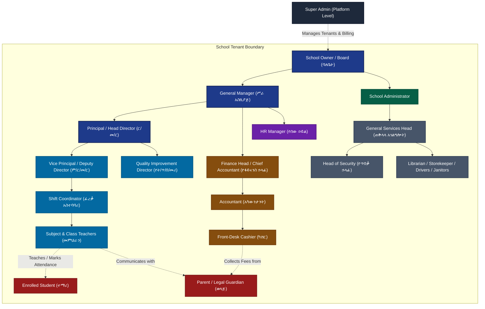

# School Management System (SMS) — Roles, Permissions & Administrative Hierarchy

> **Document Type:** System Architecture & Data Visibility Specification  
> **Institutional Framework:** Mount Olive School System (Ethiopian MoE Standard & International SIS Architecture)  
> **Status:** Active Reference & Governance Guide  

---

## 1. Executive Summary & RBAC Architecture

The School Management System (SMS) employs a **Hierarchical, Multi-Tenant Role-Based Access Control (RBAC) model enhanced with Granular Additive Permission Grants**.

```
┌─────────────────────────────────────────────────────────────────────────────┐
│                             RBAC ACCESS MODEL                               │
├─────────────────────────────────────────────────────────────────────────────┤
│                                                                             │
│   ┌─────────────────────────────────────────────────────────────────────┐   │
│   │ 1. Base System Role (Enum)                                          │   │
│   │    • Defines default operational baseline & hierarchy level         │   │
│   │    • E.g., super_admin, owner, admin, teacher, finance, cashier,    │   │
│   │      hr, shift_coordinator, security_head, student, parent, support │   │
│   └──────────────────────────────────┬──────────────────────────────────┘   │
│                                      │                                      │
│                                      ▼                                      │
│   ┌─────────────────────────────────────────────────────────────────────┐   │
│   │ 2. Custom Tenant Roles (Per-School Additive)                       │   │
│   │    • Created dynamically per school (e.g., "Quality Director",      │   │
│   │      "Vice Principal", "Accountant", "General Services Head")       │   │
│   │    • Maps to specific permission catalog keys                       │   │
│   └──────────────────────────────────┬──────────────────────────────────┘   │
│                                      │                                      │
│                                      ▼                                      │
│   ┌─────────────────────────────────────────────────────────────────────┐   │
│   │ 3. Direct User Overrides (User-Level Additive Grants)               │   │
│   │    • Directly grants individual permissions to specific staff       │   │
│   │    • Effective Access = Base Role Permissions ∪ Custom Roles ∪ Direct│  │
│   └──────────────────────────────────┬──────────────────────────────────┘   │
│                                      │                                      │
│                                      ▼                                      │
│   ┌─────────────────────────────────────────────────────────────────────┐   │
│   │ 4. Contextual Row-Level & Data Scoping Rules                        │   │
│   │    • Class/Subject Scoping (Teachers only see their students)       │   │
│   │    • Child Guardian Link Scoping (Parents only see their children)  │   │
│   │    • Self Scoping (Students only see their own grades/attendance)   │   │
│   │    • Cashier Scoping (Cashiers only see their daily collections)   │   │
│   └─────────────────────────────────────────────────────────────────────┘   │
│                                                                             │
└─────────────────────────────────────────────────────────────────────────────┘
```

### Core Security Guarantees
1. **Multi-Tenant Isolation:** Every database entity is strictly filtered by `tenant_id`. Users in School A can never view or modify data in School B.
2. **Row-Level Confidentiality:** Having a role does not grant global access to all records. For example, a `teacher` has permission `grades.manage`, but the backend strictly restricts grade entry to classes and subjects assigned to that teacher in `teacher_subjects`.
3. **Additive-Only Privilege Escalation:** Custom roles and user permissions only **add** privileges on top of a user's base role. They cannot accidentally revoke base capabilities, preventing administrative lockouts.
4. **Owner Immobility:** The `owner` role always retains the `roles.manage` permission and the school's primary administrative rights, preventing accidental self-demotion or lockout.

---

## 2. Institutional & Administrative Hierarchy



---

## 3. Comprehensive Role Taxonomy & Detailed Access Profiles

---

### Tier 1: Global Platform Management

#### 1. Super Administrator (`super_admin`)
* **Role Scope:** Platform-wide (Multi-Tenant). Operates outside any individual school tenant.
* **Primary Mission:** Platform uptime, school tenant provisioning, subscription billing, system-wide health monitoring, and global security audit.
* **What They See:**
  * **Navigation:** `Dashboard`, `School Tenants (/admin/tenants)`, `Tenant Detail (/admin/tenants/:id)`, `Global Audit Logs (/audit-logs)`.
  * **Dashboard KPIs:** Total registered schools, active branches, aggregate user count across all schools, total enrolled student headcount, breakdown of subscription tiers, system health status.
* **What They DO NOT See:**
  * Cannot view internal day-to-day student disciplinary details, individual test scores, private teacher chat conversations, or classroom attendance logs unless explicitly troubleshooting.

---

### Tier 2: School Executive & Governance

#### 2. School Owner / Board Chairperson — ባለቤት (`owner`)
* **Role Scope:** Single School Tenant — Full Root Authority.
* **Primary Mission:** Ultimate institutional governance, strategic financial oversight, school ownership transfer, policy enforcement, and final operational escalations.
* **What They See:**
  * Unrestricted tenant-wide visibility across all academic, financial, HR, operational, and audit records.
  * Access to **EVERY** module in the system.
* **Permitted Actions:** Full CRUD across all data tables, custom role management, database backups/restores, tenant settings.

#### 3. General Manager — ሥራ አስኪያጅ (`general_manager`)
* **Role Scope:** Top Executive Operations & Financial Clearance.
* **Primary Mission:** Cross-department oversight, high-value expense approvals, final payroll authorization, and board representation.
* **What They See:**
  * **Navigation:** `Dashboard`, `Executive Control (/executive-dashboard)`, `Students`, `Reports`, `Payroll`, `Salary Register`, `Audit Logs`, `Announcements`, `Chat`.
  * **Dashboard KPIs:** Net institutional cash flow, enrollment growth trajectory, attendance health, cross-department pending approvals count.
* **Permitted Actions:**
  * Execute final executive sign-off on monthly payroll runs (`payroll.approve`) prior to bank disbursement.
  * Approve capital expenditures and high-value expense requisitions exceeding school thresholds (`expenses.approve`).
  * Broadcast institutional executive announcements.

#### 4. Principal / Head Director — ር/መ/ር (`principal`)
* **Role Scope:** Academic Governance & Institutional Standards.
* **Primary Mission:** Faculty leadership, final academic authority, term exam grade locking, student promotion approvals, and disciplinary escalations.
* **What They See:**
  * **Navigation:** `Dashboard`, `Academic Governance (/principal/governance)`, `Students`, `Teachers`, `Classes`, `Subjects`, `Attendance`, `Exams`, `Timetable`, `Teacher Attendance`, `Teacher KPIs`, `Discipline (/discipline)`, `Announcements`, `Reports`, `Chat`.
* **Permitted Actions:**
  * Execute cryptographic **Final Term Grade Lock** and release official PDF report cards to parents.
  * Preside over formal student disciplinary hearings and authorize suspensions/expulsions (`discipline.manage`).
  * Provide secondary review and final sign-off on academic content submissions (`quality.review`).

#### 5. Vice Principal / Deputy Director — ም/ር/መ/ር (`vice_principal`)
* **Role Scope:** Daily Academic Operations & Student Discipline.
* **Primary Mission:** Student conduct hearings, timetable conflict resolution, exam invigilation scheduling, and KG section oversight (with KG section-scoped views).
* **What They See:**
  * **Navigation:** `Dashboard`, `Discipline (/discipline)`, `Students`, `Attendance`, `Exams`, `Timetable`, `Shift Coordinator`, `Teacher Attendance`, `Teacher KPIs`, `Announcements`, `Chat`, `Reports`.
* **Permitted Actions:**
  * Intake behavioral incident reports, log detention records, and notify parents.
  * Build exam invigilator rosters and resolve room scheduling conflicts.
  * Review academic content submissions alongside Quality Director (`quality.review`).

#### 6. Educational Quality Improvement Director — የት/ጥ/በ/መሪ (`quality_director`)
* **Role Scope:** Curriculum Compliance & Assessment Standards.
* **Primary Mission:** Reviewing tests, exams, lesson plans, notes, and worksheets before use; scoring content with pedagogical rubrics; maintaining the Approved Materials Bank.
* **What They See:**
  * **Navigation:** `Dashboard`, `Quality Assurance (/quality-assurance)`, `Students`, `Attendance`, `Exams`, `Timetable`, `Teacher KPIs`, `Reports`, `Announcements`, `Chat`.
* **Permitted Actions:**
  * Review draft test papers, quizzes, and lesson plans submitted by teachers (`quality.review`).
  * Approve content or request mandatory revisions with instructional feedback.
  * Publish approved items to the **Approved Materials Bank**.
  * Conduct teacher classroom observation appraisals and score KPI metrics.

---

### Tier 3: Shift Management & Security

#### 7. Shift Coordinator — ፈረቃ አስተባባሪ (`shift_coordinator`)
* **Role Scope:** Shift Scheduling, Staff Presence & Emergency Substitutions.
* **Primary Mission:** Daily shift duty rosters (Morning/Afternoon/KG), day/night guard shift scheduling (ፈረቃ), real-time morning presence tracking, and 1-click period substitution matching.
* **What They See:**
  * **Navigation:** `Dashboard`, `Shift & Duty Hub (/shift-coordinator)`, `Timetable`, `Teacher Attendance`, `Teacher KPIs`, `Announcements`, `Chat`.
* **Permitted Actions:**
  * View real-time staff check-in logs and approved HR leave requests (`leave.view`).
  * Assign emergency period substitutions using the automated "Free Teacher Filter".
  * Generate and manage weekly guard shift rosters (ፈረቃ) across campus posts (`shifts.manage`).

#### 8. Head of Security — የጥበቃ ኃላፊ (`security_head`)
* **Role Scope:** Campus Physical Safety & Gate Control.
* **Primary Mission:** Guard team oversight, visitor screening, student early departure control, and incident logging.
* **What They See:**
  * **Navigation:** `Dashboard`, `Security Hub (/security-hub)`, `Announcements`, `Chat`.
* **Permitted Actions:**
  * Maintain the campus Visitor Log register (Time-in, Time-out, Badge #).
  * Verify and validate digital **Student Gate Passes** at the main gate before allowing early departure.
  * Log security incident reports (auto-escalating critical cases to GM/Principal).
  * View guard shift assignments created by the Shift Coordinator (`guard-roster.view`).

---

### Tier 4: Financial & Administrative Management

#### 9. Chief Accountant — አካውንታንት (`accountant`)
* **Role Scope:** Books of Account, Reconciliation & Defaulter Tracking.
* **Primary Mission:** Daily cashier settlement audits, bank/Telebirr reconciliation, payment locking, fee defaulter aging analysis (30/60/90 days), and monthly close pack generation.
* **What They See:**
  * **Navigation:** `Dashboard`, `Accountant Portal (/accountant)`, `Fee Structures`, `Payments`, `Expenses`, `Payroll`, `Salary Register`, `Tax Settings`, `Reports`.
* **Permitted Actions:**
  * Reconcile cashier daily collection batches against bank statements and execute **Payment Batch Lock** (`payments.reconcile`).
  * Generate 30/60/90+ day fee defaulter aging reports.
  * Generate the official monthly financial close pack PDF for GM and Owner signature.

#### 10. Front-Desk Cashier / Teller — ካሸር (`cashier`)
* **Role Scope:** Counter Fee Collection & Receipt Issuance.
* **Primary Mission:** Fast student lookup, multi-modal payment recording (Cash, Telebirr, CBE Birr), instant receipt printing, and daily cash drawer reconciliation.
* **What They See:**
  * **Navigation:** `Dashboard`, `Cashier POS (/cashier/pos)`, `Students`, `Fee Structures`, `Payments`, `Reports`, `Announcements`.
* **Permitted Actions:**
  * Search students, collect tuition payments, and issue official PDF/thermal receipts.
  * View personal daily collection totals (`collected_by = req.user.userId`).
  * Submit daily cash drawer closing summaries to the Accountant.

#### 11. Human Resources Head — የሰው ኃይል (`hr`)
* **Role Scope:** Personnel Records, Leave Governance & Payroll Engine.
* **Primary Mission:** Staff directory, biometric attendance reconciliation, multi-tier leave approval, and Ethiopian PAYE progressive tax & 7%/11% pension calculations.
* **What They See:**
  * **Navigation:** `Dashboard`, `Staff Directory (/users)`, `Staff Detail (/staff/:id)`, `Teacher Attendance`, `Teacher KPIs`, `Asset Management`, `Payroll`, `Salary Register`, `Tax Settings`, `Leave Management`, `Payroll Audit`, `Reports`.
* **Permitted Actions:**
  * Approve or reject staff leave applications (sick, annual, maternity).
  * Configure Ethiopian PAYE tax brackets and run monthly payroll calculations.
  * Reconcile biometric staff check-in and check-out logs.

#### 12. General Services Head — ጠቅላላ አገልግሎት (`general_services`)
* **Role Scope:** Campus Facilities, Transport Fleet & Maintenance.
* **Primary Mission:** Work order maintenance tickets, asset inventory counts, bus transport routing, hostel bed management, and consumables purchasing requests.
* **What They See:**
  * **Navigation:** `Dashboard`, `General Services (/general-services)`, `Operations (/operations)`, `Asset Management (/assets)`, `Expenses`, `Announcements`, `Chat`.
* **Permitted Actions:**
  * Manage maintenance work order tickets (Plumbing, Electrical, Furniture) (`services.manage`).
  * Track asset assignment history and log annual inventory physical counts.
  * Manage school bus transport rosters and hostel bed allocations.
  * Submit consumable purchase requests (paper, chalk, cleaning supplies).

---

### Tier 5: Instructional & End-User Clients

#### 13. Subject & Classroom Teacher — መምህር (`teacher`)
* **Role Scope:** Instructional Delivery & Classroom Management.
* **Primary Mission:** Teaching assigned subjects, taking daily attendance, uploading test drafts and lesson plans for Quality Director approval, entering student marks, and accessing the Approved Materials Bank.
* **What They See:**
  * **Navigation:** `Dashboard`, `Teacher Workspace (/teacher/workspace)`, `Attendance`, `Exams`, `My Timetable`, `Shift Coordinator`, `Teacher KPIs`, `Announcements`, `Chat`.
* **Permitted Actions:**
  * Submit draft tests, exams, lesson plans, and notes to the Quality Director (`quality.submit`).
  * Browse and download accredited teaching aids from the **Approved Materials Bank**.
  * Enter and edit marks for assigned classes and subjects.
  * Mark daily student classroom attendance (1-click "Mark All Present").

#### 14. Parent / Legal Guardian — ወላጅ (`parent`)
* **Role Scope:** Family / Guardian Self-Service Portal.
* **What They See:**
  * Linked children profiles (Grade, GPA, Overall Average, Attendance %, Outstanding Balance).
  * Child's subject marks, published PDF report cards, itemized fee statements, and payment receipts.
  * Class timetable, school announcements, and direct chat with child's teachers.

#### 15. Enrolled Student — ተማሪ (`student`)
* **Role Scope:** Individual Student Portal.
* **What They See:**
  * Own class timetable, published term report cards, personal attendance rate %, and school announcements.

---

## 4. Master Data & Action Visibility Matrix by Feature Domain

| Feature / Domain Module | super_admin | owner | GM | principal | VP | QD | Shift Coord | Security | Acct | Cashier | HR | Gen Serv | Teacher | Parent | Student |
|---|:---:|:---:|:---:|:---:|:---:|:---:|:---:|:---:|:---:|:---:|:---:|:---:|:---:|:---:|:---:|
| **Tenant / School Setup** | ALL | ALL | READ | NO | NO | NO | NO | NO | NO | NO | NO | NO | NO | NO | NO |
| **User Account CRUD** | NO | ALL | READ | READ | READ | NO | NO | NO | NO | NO | ALL (Staff)| NO | NO | NO | NO |
| **Academic Content Vetting** | NO | ALL | READ | APPROVE | APPROVE | APPROVE | NO | NO | NO | NO | NO | NO | SUBMIT | NO | NO |
| **Approved Materials Bank** | NO | ALL | READ | READ | READ | MANAGE | NO | NO | NO | NO | NO | NO | READ | NO | NO |
| **Classes & Subjects Setup** | NO | ALL | READ | ALL | ALL | READ | READ | NO | NO | NO | NO | NO | READ | NO | NO |
| **Student Enrollment & Records** | NO | ALL | READ | ALL | ALL | READ | READ | NO | READ | READ | NO | NO | OWN | OWN (Child)| OWN (Self)|
| **Student Discipline & Hearings**| NO | ALL | READ | ALL | ALL | NO | NO | NO | NO | NO | NO | NO | REPORT | OWN (Child)| NO |
| **Student Gate Pass System** | NO | ALL | READ | ISSUE | ISSUE | NO | NO | VERIFY | NO | NO | NO | NO | NO | NO | NO |
| **Attendance — Student** | NO | ALL | READ | ALL | ALL | ALL | ALL | NO | NO | NO | NO | NO | OWN | OWN (Child)| OWN (Self)|
| **Attendance — Staff / Biometrics**| NO | ALL | READ | ALL | ALL | ALL | READ | NO | NO | NO | ALL | NO | NO | NO | NO |
| **Shift & Guard Roster (ፈረቃ)** | NO | ALL | READ | ALL | ALL | NO | MANAGE | READ | NO | NO | READ | NO | OWN | NO | NO |
| **Emergency Substitution Dispatch**| NO | ALL | READ | ALL | ALL | NO | MANAGE | NO | NO | NO | READ | NO | OWN | NO | NO |
| **Exam Creation & Grade Entry** | NO | ALL | READ | ALL | ALL | AUDIT | NO | NO | NO | NO | NO | NO | OWN | NO | NO |
| **Term Exam Final Lock** | NO | ALL | READ | EXECUTE | NO | AUDIT | NO | NO | NO | NO | NO | NO | NO | NO | NO |
| **Report Card PDF Generation** | NO | ALL | READ | ALL | ALL | ALL | NO | NO | NO | NO | NO | NO | OWN | OWN (Child)| OWN (Self)|
| **Fee Structure Configuration** | NO | ALL | READ | NO | NO | NO | NO | NO | ALL | NO | NO | NO | NO | NO | NO |
| **Counter Fee Collection (POS)** | NO | ALL | READ | NO | NO | NO | NO | NO | AUDIT | ALL | NO | NO | NO | NO | NO |
| **Payment Reconciliation & Lock**| NO | ALL | READ | NO | NO | NO | NO | NO | ALL | NO | NO | NO | NO | NO | NO |
| **Fee Defaulter Aging (30/60/90)**| NO | ALL | READ | NO | NO | NO | NO | NO | ALL | NO | NO | NO | NO | NO | NO |
| **Operating Expenses Log** | NO | ALL | APPROVE| NO | NO | NO | NO | NO | ALL | NO | NO | REQ | NO | NO | NO |
| **Staff Payroll Calculation** | NO | ALL | APPROVE| NO | NO | NO | NO | NO | ALL | NO | ALL | NO | NO | NO | NO |
| **Staff Payslip PDF Download** | NO | ALL | ALL | NO | NO | NO | NO | NO | ALL | NO | ALL | NO | OWN (Self)| NO | NO |
| **Campus Maintenance Tickets** | NO | ALL | READ | READ | READ | NO | NO | NO | NO | NO | NO | ALL | REPORT | NO | NO |
| **Campus Visitor Log Register** | NO | ALL | READ | READ | READ | NO | NO | ALL | NO | NO | NO | NO | NO | NO | NO |
| **System Backup & Restore** | NO | ALL | NO | NO | NO | NO | NO | NO | NO | NO | NO | NO | NO | NO | NO |
| **Audit Logs & Security Trail** | ALL | ALL | ALL | ALL | ALL | NO | NO | NO | ALL | NO | ALL | NO | NO | NO | NO |

---

## 5. Complete 43-Key Permission Catalog Reference

| Permission Key | Human Label | Granted Roles | Description |
|---|---|---|---|
| `dashboard.view` | View Dashboard | All active roles | Access role-specific dashboard |
| `users.manage` | Manage Staff Users | `owner`, `admin`, `hr` | Create, edit, and deactivate staff accounts |
| `teachers.manage` | Manage Teacher Allocations | `owner`, `admin` | Assign teachers to subjects and classes |
| `students.view` | View Student Records | `owner`, `admin`, `teacher`, `cashier`, `principal`, `vice_principal`, `quality_director`, `general_manager` | View student rosters and profiles |
| `students.manage` | Enroll & Edit Students | `owner`, `admin`, `cashier` | Enroll students and manage guardian links |
| `parents.manage` | Manage Guardians & Links | `owner`, `admin` | Link parents to student records |
| `classes.manage` | Setup Classes & Sections | `owner`, `admin` | Create classes and sections |
| `subjects.manage` | Manage Subject Catalog | `owner`, `admin` | Create and configure curriculum subjects |
| `attendance.manage` | Mark Student Attendance | `owner`, `admin`, `teacher`, `principal`, `vice_principal`, `quality_director` | Record student classroom attendance |
| `exams.manage` | Create & Schedule Exams | `owner`, `admin`, `teacher`, `principal`, `vice_principal`, `quality_director` | Schedule term exams and quizzes |
| `grades.manage` | Enter & Lock Grades | `owner`, `admin`, `teacher`, `principal`, `vice_principal`, `quality_director` | Enter marks and lock exam grades |
| `timetable.view` | View Class Timetables | `owner`, `admin`, `teacher`, `student`, `parent`, `principal`, `vice_principal`, `quality_director`, `shift_coordinator` | View weekly class schedules |
| `timetable.manage` | Build & Edit Timetables | `owner`, `admin` | Build master school timetables |
| `chat.access` | Internal Multi-User Chat | `owner`, `admin`, `teacher`, `parent`, `principal`, `vice_principal`, `quality_director`, `general_manager`, `support`, `shift_coordinator`, `security_head` | Send and receive direct messages |
| `announcements.view` | Read School Notices | All active roles | View announcements |
| `announcements.manage`| Publish Announcements | `owner`, `admin`, `principal`, `general_manager` | Publish school-wide or targeted circulars |
| `fees.manage` | Setup Fee Structures | `owner`, `admin`, `finance`, `accountant` | Create and price fee structures |
| `payments.manage` | Record Fee Payments | `owner`, `admin`, `finance`, `cashier`, `accountant` | Collect fees and record payments |
| `expenses.manage` | Log Operating Expenses | `owner`, `admin`, `finance`, `accountant`, `general_services` | Record operating expenses and claims |
| `payroll.view` | View Staff Payrolls | `owner`, `admin`, `finance`, `hr`, `general_manager`, `accountant` | View payroll registers and payslips |
| `payroll.manage` | Run Monthly Payroll | `owner`, `admin`, `hr`, `finance` | Compute monthly payroll runs |
| `reports.view` | View School Analytics | `owner`, `admin`, `finance`, `cashier`, `hr`, `principal`, `vice_principal`, `quality_director`, `general_manager`, `accountant` | View analytical reports |
| `operations.manage` | Transport, Hostel, Library | `owner`, `admin`, `general_services` | Manage campus logistics |
| `backup.manage` | Backup & Restore DB | `owner`, `admin` | Execute database backup and restore |
| `import.manage` | Bulk Excel/CSV Import | `owner`, `admin` | Import student and staff files |
| `tax-settings.manage` | PAYE Tax Brackets | `owner`, `admin`, `hr`, `accountant` | Configure Ethiopian PAYE tax tiers |
| `leave-management.manage`| Approve Staff Leaves | `owner`, `admin`, `hr` | Approve or reject staff leaves |
| `payroll-audit.view` | Audit Payroll Changes | `owner`, `admin`, `hr` | View payroll audit trail |
| `audit.view` | View System Audit Logs | `super_admin`, `owner`, `admin`, `general_manager` | View system audit logs |
| `settings.manage` | School Identity & Config | `owner`, `admin` | Configure school settings |
| `roles.manage` | Manage Custom Roles & RBAC | `owner`, `admin` | Create custom roles and user overrides |
| `academics.manage` | Academic Years & Rollover | `owner`, `admin` | Manage terms and annual promotion rollovers |
| `quality.submit` | Submit Academic Content | `teacher` | Upload draft tests, lesson plans, notes |
| `quality.review` | Review & Approve Content | `quality_director`, `principal`, `vice_principal` | Score content against rubrics & approve |
| `shifts.manage` | Manage Shift & Duty Roster | `shift_coordinator` | Schedule substitutions, guard shifts, duty rotas |
| `guard-roster.view`| View Guard Shift Roster | `security_head`, `shift_coordinator` | View daily security guard shifts (ፈረቃ) |
| `leave.view` | View Staff Leaves | `shift_coordinator`, `hr`, `principal`, `vice_principal` | View approved leaves for substitution planning |
| `payroll.approve` | Executive Payroll Sign-Off | `general_manager` | Authorize final payroll disbursement |
| `expenses.approve` | Approve Expense Thresholds | `general_manager` | Approve high-value expense requisitions |
| `security.manage` | Security & Visitor Gate | `security_head` | Manage visitor log, verify student gate passes |
| `services.manage` | Campus Facilities & Repairs | `general_services` | Manage maintenance tickets and assets |
| `discipline.manage`| Student Disciplinary Cases | `principal`, `vice_principal` | Manage hearings, suspensions, expulsions |
| `payments.reconcile`| Reconcile & Lock Payments | `accountant` | Perform cashier settlement and lock receipts |

