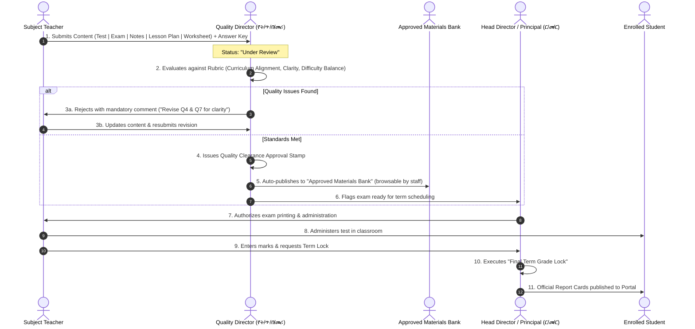
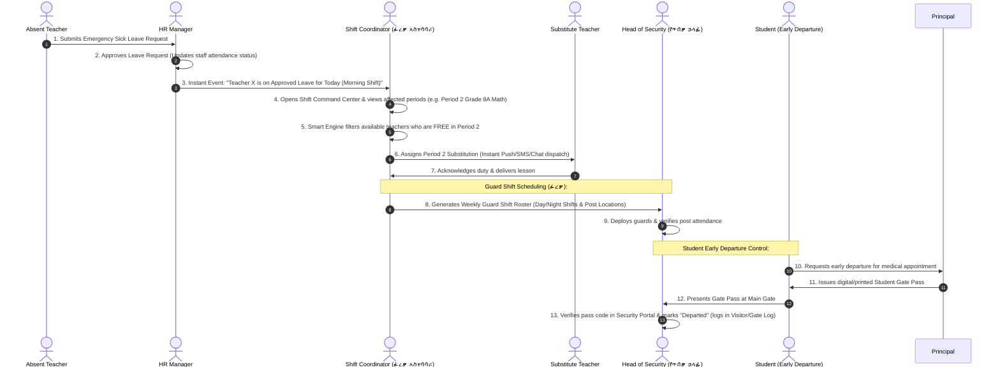

# School Management System (SMS) — Role Workflows, Interactive Interfaces & System Implementation Blueprint

> **Document Type:** Role-by-Role Operational Blueprint & UI/UX Functional Specification  
> **Institutional Framework:** Mount Olive School System (Ethiopian MoE Standard & International SIS Architecture)  
> **Status:** Actionable Blueprint & Comprehensive Gap Resolution Plan  

---

## 1. Executive Overview & Problem Statement

A standard CRUD (Create, Read, Update, Delete) school system treats users as passive data viewers. However, in **real-world school operations (combining Ethiopian Ministry of Education structures and international benchmarks like PowerSchool Schoolnet)**, institutional roles operate through **active, interconnected operational pipelines**:

```
┌────────────────────────────────────────────────────────────────────────────────────────┐
│                          CORE SCHOOL INTER-ROLE PIPELINES                              │
├────────────────────────────────────────────────────────────────────────────────────────┤
│                                                                                        │
│  1. Academic Quality Pipeline (የትምህርት ጥራት ማሻሻያ):                                 │
│     Teacher Drafts Test/Lesson Plan/Notes ──> Quality Director Rubric Review           │
│     ──> Approved Materials Bank ──> Principal Term Exam Lock                          │
│                                                                                        │
│  2. Shift, Guard & Emergency Duty Pipeline (ፈረቃ አስተባባሪ & የጥበቃ ኃላፊ):             │
│     HR Leave Event ──> Shift Coordinator Live Command Board                            │
│     ──> 1-Click Free Period Teacher Substitute ──> Guard Shift Roster (Day/Night)      │
│     ──> Security Student Gate Pass Verification at Gate                                │
│                                                                                        │
│  3. Financial Collection & Accounting Pipeline (ካሸር & አካውንታንት):                      │
│     Parent Counter Payment ──> Cashier POS Slip ──> End-of-Day Cash Drawer Close       │
│     ──> Accountant Bank Reconciliation ──> Payment Lock ──> Defaulter Aging (30/60/90)│
│                                                                                        │
│  4. Executive Governance & Disciplinary Pipeline (ሥራ አስኪያጅ, ር/መ/ር & ም/ር/መ/ር):     │
│     Disciplinary Incident ──> VP Hearing ──> Principal Sanction                        │
│     ──> GM Expense Threshold Approval ──> GM Payroll Final Sign-Off                    │
│                                                                                        │
└────────────────────────────────────────────────────────────────────────────────────────┘
```

---

## 2. Cross-Role Collaborative Workflows (Mermaid Sequence Diagrams)

### Workflow 1: Academic Content Approval & Materials Bank Pipeline (የት/ጥ/በ/መሪ)


---

### Workflow 2: Shift, Substitution & Campus Security Gate Pass Pipeline (ፈረቃ & ጥበቃ)


---

### Workflow 3: Counter Collection, Cash Handover & Accounting Reconciliation (ካሸር & አካውንታንት)
```mermaid
sequenceDiagram
    autonumber
    actor Parent as Parent / Guardian
    actor Cashier as Front-Desk Cashier (ካሸር)
    actor Acct as Accountant (አካውንታንት)
    actor GM as General Manager (ሥራ አስኪያጅ)
    actor Bank as Bank / Telebirr / CBE

    Parent->>Cashier: 1. Pays Term 1 Tuition at counter ($450: $200 Cash + $250 Telebirr)
    Cashier->>Cashier: 2. POS input with Telebirr Ref ID; issues Official Receipt & Clearance Slip
    Note over Cashier: End of Day:
    Cashier->>Cashier: 3. Closes Cash Drawer Session (Generates Day Batch Summary)
    Cashier->>Acct: 4. Hands over physical cash ($2,400) + POS batch report
    Acct->>Bank: 5. Reconciles Cash + Telebirr/CBE statements vs recorded receipts
    alt Discrepancy Found
        Acct->>Cashier: 6a. Flags mismatch & requests explanation
    else Reconciliation Balanced
        Acct->>Acct: 6b. Signs off & executes "Payment Batch Lock" (Prevents tampering)
        Acct->>GM: 7. Generates Monthly Financial Close Pack (Collections, Expenses, Net)
        GM->>GM: 8. Signs off on Monthly Institutional Financial Statement
    end
```

---

## 3. Deep Dive: Role-by-Role Operational Blueprints & UI Specifications

---

### ROLE 1: Educational Quality Improvement Director — የት/ጥ/በ/መሪ (`quality_director`)

#### 1. Real-World Role & Institutional Scope
Based on **Ethiopia MoE የት/ጥራት ማሻሻል guidelines, Kenya MoE QAS, and PowerSchool Schoolnet standards**:
* Reviews tests, exams, notes, lesson plans, and worksheets submitted by teachers **BEFORE** classroom delivery.
* Evaluates submissions using a standardized pedagogical rubric.
* Approves or requests revisions with mandatory corrective commentary.
* Maintains the **Approved Materials & Test Item Bank** browsable by all teachers.
* Tracks teacher appraisal KPIs, syllabus completion rates, and classroom observations.

#### 2. Connected Roles & Dependencies
* **Teachers:** Submit content (`draft` → `submitted` → `needs_revision` → `approved`) and receive feedback.
* **Principal & Vice Principal:** Receives escalated quality alerts and exam clearance sign-offs.
* **HR Manager:** Receives teacher submission punctuality and syllabus coverage metrics for quarterly appraisals.

#### 3. Dedicated UI Page: `QualityAssurancePage.jsx` (`/quality-assurance`)

##### Header & Quality KPI Strip
* **Pending Content Submissions:** `14 items waiting`
* **Lesson Plan On-Time Rate:** `94.2%`
* **Syllabus Coverage Index:** `88.5% on track`
* **Average Assessment Quality Score:** `4.40 / 5.00`

##### Tab 1: Content Review Center (`/quality-assurance?tab=review-center`)
* **Filter Bar:** Content Type (`Test`, `Exam`, `Notes`, `Lesson Plan`, `Worksheet`), Grade Level, Subject, Teacher, Status (`Pending Review`, `Changes Requested`, `Approved`).
* **Content Vetting Workspace:** Clicking "Review" opens a **split-screen viewer**:
  * **Left Pane:** Content document / questions + attached Answer Key / Marking Scheme.
  * **Right Pane (Quality Rubric Scorecard):**
    * [x] Curriculum Objective Alignment (1–5 pts)
    * [x] Cognitive Rigor Balance (Knowledge, Understanding, Application)
    * [x] Clarity & Formatting (Grammar, diagrams, readability)
    * [x] Answer Key Accuracy & Marking Scheme Completeness
  * **Feedback Box:** Mandatory comment field on rejection/revision requests.
  * **Action Buttons:** `[Request Changes]`, `[Reject]`, `[Approve & Add to Materials Bank]`.

##### Tab 2: Approved Materials Bank (`/quality-assurance?tab=materials-bank`)
* Searchable institutional repository of approved lesson plans, study guides, and past test items.
* Filter by Subject, Grade, and Term. Allows other teachers in the department to reuse accredited materials.

##### Tab 3: Syllabus Pacing & Teacher Observation Rubric (`/quality-assurance?tab=pacing`)
* Pacing timeline comparing actual curriculum coverage vs. target calendar week.
* Classroom observation form with 5-domain evaluation rubric feeding HR appraisals.

---

### ROLE 2: Shift Coordinator — ፈረቃ አስተባባሪ (`shift_coordinator`)

#### 1. Real-World Role & Institutional Scope
In Ethiopian and multi-shift schools:
* **Owns the Shift & Duty Roster:** Schedules day and night guard shifts (ፈረቃ = security duty) and assigns teacher period duties.
* **Monitors Morning Attendance & Staff Presence:** Cross-checks staff biometric check-in vs. absences and tardiness.
* **Executes Emergency Period Substitutions:** Matches absent teachers to free colleagues in that exact period and shift.
* **Maintains Shift Continuity:** Reports daily coverage metrics and staffing gaps to the Vice Principal and HR.

#### 2. Connected Roles & Dependencies
* **HR Manager:** Instant sync with approved leave requests (`leave.view`).
* **Teachers:** Receive substitution alerts with lesson notes.
* **Security Head (የጥበቃ ኃላፊ):** Receives the weekly guard shift roster (ፈረቃ).
* **Vice Principal:** Receives weekly absence and period coverage summaries.

#### 3. Dedicated UI Page: `ShiftDutyHubPage.jsx` (`/shift-coordinator`)

##### Header & Shift Selector
* **Shift Toggle:** `[Morning Shift (07:45 - 12:30)]` | `[Afternoon Shift (13:00 - 17:30)]` | `[KG Unit]`
* **Live KPI Counters:** Staff On Duty (`35`), Approved HR Leaves (`2`), Unreported Absent (`1`), Uncovered Periods (`0`).

##### Section 1: Today's Classroom Timetable & Substitution Board
* Interactive matrix of Periods 1 to 6 across all classrooms.
* Unassigned periods pulse in **Red Alert**.
* Clicking opens the **Smart Substitute Drawer**:
  * Displays absent teacher's handover notes.
  * Auto-queries and ranks teachers who have **zero classes in that specific period**.
  * 1-click `[Assign Substitute]` dispatches SMS/Notification to the substitute.

##### Section 2: Guard Shift Roster Manager (ፈረቃ)
* Weekly scheduling board assigning security personnel to **Day Shift (06:00 - 18:00)** and **Night Shift (18:00 - 06:00)** across campus posts (Main Gate, KG Gate, Admin Block, Dormitories).
* Read-accessible by the Head of Security.

---

### ROLE 3: Head of Security — የጥበቃ ኃላፊ (`security_head`)

#### 1. Real-World Role & Institutional Scope
Maintains campus physical safety, gate security, visitor screening, and student early-departure control.

#### 2. Connected Roles & Dependencies
* **Shift Coordinator:** Receives guard duty shift allocations (ፈረቃ).
* **Principal & Front-Desk Admin:** Issues authorized Student Gate Passes.
* **General Manager:** Receives automated alerts on critical security incidents.

#### 3. Dedicated UI Page: `SecurityHubPage.jsx` (`/security-hub`)

##### Tab 1: Visitor Log Register
* Log entry: Visitor Full Name, National ID / Phone, Person Visited (Staff/Student), Purpose of Visit, Badge Number, Time-In, Time-Out.

##### Tab 2: Student Gate Pass Verification (Early Departure Control)
* Prevents students from leaving school premises during instructional hours without verified authorization.
* Security enters Student ID or scans Pass QR Code -> Verifies issuing administrator, departure reason, and parent pickup authorization -> Clicks **"Approve Gate Departure"**.

##### Tab 3: Campus Incident Register
* Logs security infractions (Trespassing, property damage, physical altercations).
* Severity tag (`Low`, `Medium`, `High`, `Critical`). Critical events automatically alert the GM and Principal.

##### Tab 4: Guard Shift Post Roster
* View today's guard deployment across campus posts as scheduled by the Shift Coordinator.

---

### ROLE 4: Accountant — አካውንታንት (`accountant`)

#### 1. Real-World Role & Institutional Scope
Maintains the official books of account, reconciles cash and bank transactions, monitors fee defaulters, and prepares the monthly financial close pack (distinct from the strategic Finance Head and counter Cashier).

#### 2. Dedicated UI Page: `AccountantReconciliationPage.jsx` (`/accountant`)

##### Tab 1: Daily Cashier Reconciliation & Payment Lock
* Groups counter collections by Cashier, payment method (Cash, Telebirr, CBE Birr, Bank Slip).
* Compares cashier physical cash handovers against bank transaction statements.
* **Payment Batch Lock Action:** Once reconciled, clicks `[Lock Payment Batch]`, preventing any edits or deletions.

##### Tab 2: Fee Defaulter Aging Analysis
* Bucketed overdue receivables: `Current`, `30–59 Days Overdue`, `60–89 Days Overdue`, `90+ Days Overdue`.
* Generates automated reminder SMS/Letter notices for parents.

##### Tab 3: Monthly Financial Close Pack
* 1-Click PDF generation: Consolidated Tuition Collections, Operating Expenses by Category, Net Payroll Payout, Net Cash Position — formatted for GM and Owner executive signature.

---

### ROLE 5: General Manager — ሥራ አስኪያጅ (`general_manager`)

#### 1. Real-World Role & Institutional Scope
Top institutional executive overseeing cross-departmental operations, capital expenditures, and executive approvals.

#### 2. Dedicated UI Page: `ExecutiveDashboardPage.jsx` (`/executive-dashboard`)

##### Executive Command Overview
* High-level institutional metrics: Revenue vs. Expenses, Cash Flow, Enrollment Growth %, Staff Headcount, Institutional Attendance Health.

##### Executive Approval Queue
1. **Payroll Final Sign-Off (`payroll.approve`):** Reviews monthly payroll computed by HR and Finance; executes executive approval before bank disbursement.
2. **High-Threshold Expense Approval (`expenses.approve`):** Expense requisitions exceeding school threshold (e.g., > 10,000 ETB) automatically route to the GM approval queue.

---

### ROLE 6: General Services Head — ጠቅላላ አገልግሎት (`general_services`)

#### 1. Real-World Role & Institutional Scope
Non-teaching campus operations: facilities maintenance, vehicle transport fleet, hostel accommodations, and consumable supplies purchasing.

#### 2. Dedicated UI Page: `GeneralServicesPage.jsx` (`/general-services`)

##### Tab 1: Campus Maintenance Work Orders
* Work order ticket system (Plumbing, Electrical, Furniture repairs, Painting).
* Assign internal technician, log repair parts cost, update status (`Open`, `In Progress`, `Resolved`).

##### Tab 2: Asset Registry & Annual Inventory Count
* Equipment tracking with assignment history and condition logs (`Available`, `In Use`, `Maintenance`, `Broken`, `Disposed`).

##### Tab 3: Consumables Purchasing Requests
* Requisitions for chalk, printing paper, cleaning chemicals, laboratory supplies. Requisitions exceeding budget route to GM for approval.

---

### ROLE 7: Principal & Vice Principal — ር/መ/ር እና ም/ር/መ/ር (`principal`, `vice_principal`)

#### 1. Real-World Role & Institutional Scope
* **Principal (ር/መ/ር):** Final academic authority, secondary review on Quality submissions, grade locking, student expulsions/appeals.
* **Vice Principal (ም/ር/መ/ር):** Daily student discipline, timetable conflict resolution, and KG unit supervision (with section scoping for KG classes).

#### 2. Dedicated Interfaces
* **Discipline Management Hub (`/discipline`):** Incident intake, student disciplinary hearings, parent conference minutes, and formal sanctions (Warning, Suspension, Expulsion).
* **Term Exam Locking Center:** Final audit of gradebooks and one-click term grade locking.
* **Timetable Conflict Resolver:** Live detection of room or teacher scheduling overlaps.

---

### ROLE 8: Subject Teacher — መምህር (`teacher`)

#### 1. Dedicated Interface: `TeacherWorkspacePage.jsx` (`/teacher/workspace`)
* **"My Submissions" Center:**
  * Upload draft test papers, quizzes, lesson plans, worksheets, and lecture notes.
  * Status timeline (`Draft` → `Submitted` → `Needs Revision` → `Approved`).
  * View Quality Director feedback and resubmit revised versions.
* **Approved Materials Bank Access:** Download accredited teaching materials and past tests created by department colleagues.
* **Interactive Gradebook & 1-Click Attendance:** Spreadsheet mark entry and rapid daily classroom attendance taking.
* **Personal KPI & Observation Feedback:** View quarterly pedagogical ratings and feedback notes from the Quality Director.

---

## 4. Complete Database Migrations (Migration 038 & Beyond)

The following tables implement all required operational subsystems:

```sql
-- 1. Academic Content Submissions (Quality Director Workflow)
CREATE TABLE content_submissions (
    id UUID PRIMARY KEY DEFAULT gen_random_uuid(),
    tenant_id UUID NOT NULL REFERENCES tenants(id) ON DELETE CASCADE,
    teacher_id UUID NOT NULL REFERENCES users(id) ON DELETE CASCADE,
    type VARCHAR(50) NOT NULL, -- test, exam, notes, lesson_plan, worksheet
    title VARCHAR(255) NOT NULL,
    class_id UUID REFERENCES classes(id) ON DELETE SET NULL,
    subject_id UUID REFERENCES subjects(id) ON DELETE SET NULL,
    academic_year_id UUID REFERENCES academic_years(id),
    term_id UUID REFERENCES terms(id),
    week_number INTEGER,
    body TEXT,
    attachment_url VARCHAR(500),
    answer_key_url VARCHAR(500),
    status VARCHAR(50) NOT NULL DEFAULT 'draft', -- draft, submitted, needs_revision, approved, archived
    submitted_at TIMESTAMP,
    reviewed_by UUID REFERENCES users(id),
    reviewed_at TIMESTAMP,
    review_comment TEXT,
    rubric_scores JSONB, -- { alignment: 5, difficulty: 4, clarity: 5, answer_key: 5 }
    is_banked BOOLEAN DEFAULT false, -- Published to Approved Materials Bank
    created_at TIMESTAMP DEFAULT NOW(),
    updated_at TIMESTAMP DEFAULT NOW()
);

-- 2. Submission Revision Comments Timeline
CREATE TABLE submission_comments (
    id UUID PRIMARY KEY DEFAULT gen_random_uuid(),
    tenant_id UUID NOT NULL REFERENCES tenants(id) ON DELETE CASCADE,
    submission_id UUID NOT NULL REFERENCES content_submissions(id) ON DELETE CASCADE,
    user_id UUID NOT NULL REFERENCES users(id) ON DELETE CASCADE,
    comment TEXT NOT NULL,
    created_at TIMESTAMP DEFAULT NOW()
);

-- 3. Guard Shift Rosters (Shift Coordinator & Security Head Workflow)
CREATE TABLE guard_shifts (
    id UUID PRIMARY KEY DEFAULT gen_random_uuid(),
    tenant_id UUID NOT NULL REFERENCES tenants(id) ON DELETE CASCADE,
    guard_user_id UUID NOT NULL REFERENCES users(id) ON DELETE CASCADE,
    shift_date DATE NOT NULL,
    shift_type VARCHAR(50) NOT NULL, -- day (06:00-18:00), night (18:00-06:00)
    post_location VARCHAR(100) NOT NULL, -- Main Gate, KG Gate, Admin Block, Dormitory
    status VARCHAR(50) DEFAULT 'scheduled', -- scheduled, on_duty, completed, absent
    assigned_by UUID REFERENCES users(id),
    notes TEXT,
    created_at TIMESTAMP DEFAULT NOW(),
    updated_at TIMESTAMP DEFAULT NOW(),
    UNIQUE(tenant_id, guard_user_id, shift_date, shift_type)
);

-- 4. Visitor Gate Logs (Security Head Workflow)
CREATE TABLE visitor_logs (
    id UUID PRIMARY KEY DEFAULT gen_random_uuid(),
    tenant_id UUID NOT NULL REFERENCES tenants(id) ON DELETE CASCADE,
    visitor_name VARCHAR(255) NOT NULL,
    phone VARCHAR(50),
    national_id VARCHAR(100),
    person_visited VARCHAR(255) NOT NULL,
    purpose TEXT NOT NULL,
    badge_number VARCHAR(50),
    time_in TIMESTAMP DEFAULT NOW(),
    time_out TIMESTAMP,
    recorded_by UUID REFERENCES users(id),
    created_at TIMESTAMP DEFAULT NOW()
);

-- 5. Student Gate Passes (Early Departure Security Control)
CREATE TABLE student_gate_passes (
    id UUID PRIMARY KEY DEFAULT gen_random_uuid(),
    tenant_id UUID NOT NULL REFERENCES tenants(id) ON DELETE CASCADE,
    student_id UUID NOT NULL REFERENCES students(id) ON DELETE CASCADE,
    issued_by UUID NOT NULL REFERENCES users(id), -- Admin / Principal / Front-Desk
    departure_date DATE NOT NULL,
    departure_time TIME NOT NULL,
    reason TEXT NOT NULL,
    authorized_pickup_person VARCHAR(255),
    pass_code VARCHAR(50) NOT NULL UNIQUE,
    status VARCHAR(50) DEFAULT 'issued', -- issued, verified_departed, cancelled
    verified_by_security UUID REFERENCES users(id),
    verified_at TIMESTAMP,
    created_at TIMESTAMP DEFAULT NOW()
);

-- 6. Campus Maintenance Requests (General Services Workflow)
CREATE TABLE maintenance_requests (
    id UUID PRIMARY KEY DEFAULT gen_random_uuid(),
    tenant_id UUID NOT NULL REFERENCES tenants(id) ON DELETE CASCADE,
    title VARCHAR(255) NOT NULL,
    location VARCHAR(255) NOT NULL,
    category VARCHAR(100) NOT NULL, -- electrical, plumbing, furniture, structural, other
    description TEXT NOT NULL,
    reported_by UUID NOT NULL REFERENCES users(id),
    assigned_to VARCHAR(255),
    estimated_cost DECIMAL(12,2) DEFAULT 0,
    actual_cost DECIMAL(12,2) DEFAULT 0,
    status VARCHAR(50) DEFAULT 'open', -- open, in_progress, completed, cancelled
    completed_at TIMESTAMP,
    notes TEXT,
    created_at TIMESTAMP DEFAULT NOW()
);

-- 7. Payment Reconciliation Batches & Payment Locking (Accountant Workflow)
CREATE TABLE payment_reconciliation_batches (
    id UUID PRIMARY KEY DEFAULT gen_random_uuid(),
    tenant_id UUID NOT NULL REFERENCES tenants(id) ON DELETE CASCADE,
    batch_date DATE NOT NULL,
    reconciled_by UUID NOT NULL REFERENCES users(id), -- Accountant
    cashier_id UUID REFERENCES users(id),
    total_cash DECIMAL(12,2) DEFAULT 0,
    total_telebirr DECIMAL(12,2) DEFAULT 0,
    total_cbe DECIMAL(12,2) DEFAULT 0,
    total_other DECIMAL(12,2) DEFAULT 0,
    status VARCHAR(50) DEFAULT 'reconciled_and_locked',
    notes TEXT,
    created_at TIMESTAMP DEFAULT NOW()
);
```

---

## 5. Granular Permission Catalog Upgrades

| Permission Key | Human Label | Granted To | Description |
|---|---|---|---|
| `quality.submit` | Submit Academic Content | `teacher` | Upload tests, lesson plans, notes for review |
| `quality.review` | Review & Approve Content | `quality_director`, `principal`, `vice_principal` | Review and approve/reject teacher content |
| `shifts.manage` | Manage Shift & Duty Roster | `shift_coordinator` | Schedule substitutions, guard shifts, duty rotas |
| `guard-roster.view`| View Guard Shift Roster | `security_head`, `shift_coordinator` | View daily security guard shifts (ፈረቃ) |
| `leave.view` | View Staff Leaves | `shift_coordinator`, `hr`, `principal`, `vice_principal` | View approved leaves for substitution planning |
| `payroll.approve` | Executive Payroll Sign-Off | `general_manager` | Sign off and authorize payroll batch execution |
| `expenses.approve` | Approve Expense Thresholds | `general_manager` | Approve high-value expense requisitions |
| `security.manage` | Security & Visitor Gate | `security_head` | Manage visitor log, verify student gate passes |
| `services.manage` | Campus Facilities & Repairs | `general_services` | Manage maintenance tickets and assets |
| `discipline.manage`| Student Disciplinary Cases | `principal`, `vice_principal` | Manage hearings, suspensions, expulsions |
| `payments.reconcile`| Reconcile & Lock Payments | `accountant` | Perform cashier settlement and lock receipts |

---

## 6. Implementation Action Plan & Phased Build Order

### Phase 1: The Core Educational & Shift Subsystems
1. **Academic Content Approval & Materials Bank Subsystem:**
   * Run migration for `content_submissions` and `submission_comments`.
   * Implement Backend Controller & Service: `GET/POST /api/academic-content`, `POST /api/academic-content/:id/review`, `GET /api/academic-content/bank`.
   * Build Frontend Pages:
     * `QualityAssurancePage.jsx` (`/quality-assurance`): Review Center, Approved Bank, Rubric Scoring.
     * Teacher "My Submissions" Tab in `TeacherWorkspacePage.jsx` (`/teacher/workspace`).
2. **Shift & Duty Hub Subsystem:**
   * Run migration for `guard_shifts`.
   * Add `leave.view` permission and wire HR leave feed into `shifts.service.js`.
   * Build `ShiftDutyHubPage.jsx` (`/shift-coordinator`): Live morning presence board, Smart Period Substitution drawer, Guard shift roster.

### Phase 2: Accounting Reconciliation & Executive Governance
3. **Accountant Reconciliation & Defaulter Aging Suite:**
   * Build `AccountantReconciliationPage.jsx` (`/accountant`): Daily cashier settlements, payment batch locking, 30/60/90-day aging report, monthly close pack.
4. **General Manager Executive Control:**
   * Build `ExecutiveDashboardPage.jsx` (`/executive-dashboard`): Financial health KPIs, `payroll.approve` gate, `expenses.approve` threshold queue.

### Phase 3: Security Operations & General Services
5. **Security Management Suite:**
   * Run migrations for `visitor_logs` and `student_gate_passes`.
   * Build `SecurityHubPage.jsx` (`/security-hub`): Visitor log, student gate pass verification, campus incident register, guard shift viewer.
6. **General Services & Facilities Hub:**
   * Run migration for `maintenance_requests`.
   * Build `GeneralServicesPage.jsx` (`/general-services`): Work order maintenance queue, asset registry, purchasing requisitions.
7. **Discipline Management Portal:**
   * Build `DisciplineManagementPage.jsx` (`/discipline`): Formal hearing logs, parent conference minutes, and sanction tracking for Principal and VP.

